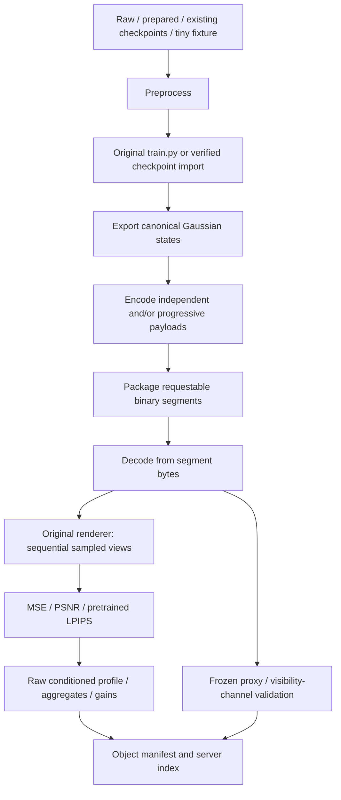

# Content preparation for Dynamic-LapisGS

Implementation date: 2026-10-04. Scope: offline server content only. Training, losses and `gaussian_renderer.render` remain the repository's existing implementations.

## Inspection and implementation plan

Inspected `dataset_prepare.py`, `train.py`, `train_full_pipeline.py`, `scene/gaussian_model.py`, camera/renderer code, environment setup, and these existing experiments:

| Existing implementation | Reused principle |
| --- | --- |
| `prepare_progressive_real.py` | Original Open3D preprocessing and original image resize, isolated subprocesses |
| `check_progressive_composability.py` | Inherited row lineage, sparse replacements of shared attributes, unchanged train CLI |
| `evaluate_correction_coding.py` | Numeric domains, actual packet sizes, corruption checks |
| `evaluate_full_payload_coding.py` | Refinement against the **decoded** parent; payload-only decode |
| `evaluate_temporal_geometry.py` | Explicit distinction between temporal prediction and independent frame access |

Implementation sequence: unified state/codec → dependency-aware packaging → decoded rendering/metrics/profile/proxy → journal/CLI/manifest → bounded tests and smoke. Experiment directories and old scripts are not rewritten or invoked as full experiments.

The exact LTS encoder is unavailable in the inspected public/local sources. Its paper describes enhanced lossless Draco; our adapter supplies a conventional, explicitly named attribute-compression baseline. See [codec inspection](CONTENT_PREPARATION_CODEC.md) for primary-source links and the precise reproduction boundary.

## Pipeline and modules



| Module | Responsibility |
| --- | --- |
| `config.py` | YAML validation, frame/timestamp mapping, safe IDs, memory contract |
| `checkpoint.py` | Atomic task journal, SHA-256 inputs/outputs, process locks |
| `upstream.py` | Original preprocessing/train subprocess orchestration, lineage/source verification |
| `assets.py` | CPU state, deterministic NPZ, compatible upstream PLY |
| `codec_adapter.py` | `encode(state,path,config,parent)` / `decode(path,parent)`; replaceable adapter interface |
| `packaging.py` | Actual CPSEG1 containers, boundaries, cold dependency closure |
| `renderer_adapter.py` | Reconstruct GaussianModel tensors and call original renderer |
| `metrics.py` | MetricResult and a separate DistortionAggregator |
| `quality_profile.py` | Raw bins, indexing, interpolation, reports and signed gains |
| `proxy.py` | ProxyBackend interface, frozen Gaussian subset, geometric validation |
| `manifest.py`, `validation.py` | Manifest generation/roundtrip and structural/byte/hash validation |
| `pipeline.py`, `prepare_content.py` | Sequential execution and CLI |

## Inputs and preprocessing/training

Dataset kinds are `raw`, `prepared`, `checkpoints`, and `synthetic`. Raw inputs use configurable filename templates, train/test poses, resolution scales and base image width. A worker calls the original `dataset_prepare.render_2d_image` and `rescale_image` for one frame, then exits. It records the actual upstream per-frame AABB centering, divisor, rotation, translation and raw hash. This existing preprocessing has dataset-specific normalization; changing object names does not invent a new canonicalization method. Prepared inputs are copied into pipeline-owned frame/quality directories before initialization; the original inputs are not modified.

Initialization follows the existing NeRF reader's 100,000-point random distribution, seeded explicitly before source hashes are recorded. Training uses unchanged `train.py`: first-frame higher qualities inherit the lower-quality foundation with dynamic opacity; later frames load their own previous quality and disable densification/opacity reset as in the existing orchestration. Training images reside on CPU and the original loop transfers one sampled view to CUDA. Original training RNG remains its upstream seed 0; initialization/fixture seed is separately configured and recorded.

The wrapper processes one object, then one quality, then its frames. Every training job is a separate process. Progressive PLY imports require **original** argv and original checkpoint SHA-256 records, inherited foundation-prefix checks and temporal row/static-state checks. Merely hashing an arbitrary PLY today cannot establish lineage. Independent states can encode without cross-quality identity; a temporally tracked proxy still requires persistent IDs. Explicit-ID NPZ/extended PLY assets and wrapper-trained checkpoints provide these IDs.

An imported checkpoint manifest follows the existing experiment schema:

```json
{"frames":[{"frame":1051,"Q0":"/path/q0.ply","Q1":"/path/q1.ply"}],
 "commands":[{"frame":1051,"level":"Q0","argv":["python","train.py","..."],"sha256":"original checkpoint SHA256"}]}
```

Every selected frame/quality needs its own command record for progressive import. Use `dataset.kind: checkpoints`, `dataset.checkpoint_manifest: ...`, and `training.backend: existing`. Checkpoint paths may be relative to that manifest; original argv retains its original path semantics. Missing frames fail explicitly.

## Internal asset format and output layout

`GaussianState` holds CPU float32 `xyz[N,3]`, raw wxyz `rotation[N,4]`, log `scale[N,3]`, logit `opacity[N,1]`, channel-major `sh[N,3,(degree+1)^2]`, stable int64 IDs and metadata. NPZ members have fixed ZIP timestamps and never use pickle. Numeric state hashes include shapes/domains/IDs/order; provenance is additionally protected by the whole-file hash. PLY import follows upstream field ordering and extended export adds an ignored `gaussian_id` field.

```text
output/content_prepare_*/
  .preparation/{owner.json,resolved_config.json,journal.json,run.lock}
  manifest.json                     # multi-object server index
  validation_upstream.json
  object_id/
    input/ checkpoints/ models/ logs/   # offline input/training artifacts
    qualities/Q*/frame.npz
    encoded/{independent/Q*,progressive/Base,E*}/frame.cpgs
    media/mode/layer/gof_*/segment_*.cpseg
    package.json package_index.json
    decoded/mode/layer/frame.npz
    profiles/{profile.json,gains.json,aggregates.json,images/,samples/}
    proxy/{index.json,frame.npz,renders/,validation.json}
    manifest.json validation.json
    .work/                          # encoder reconstruction and temporary working files
```

Only the object manifest, its referenced segment files and auxiliary profile/proxy assets need server delivery. Training, exported states, standalone encoded intermediates, decoded caches and render images can remain offline. Client payload/profile/proxy paths are relative to the appropriate object/descriptor root. Private training/journal provenance also records local input paths.

## Two delivery modes from the same qualities

Independent Q0/Q1/Q2 packets reconstruct complete states; switching to Q1 never requires Q0. Progressive Base/E1/E2 reconstruct the same quantized targets: Base → Q0, Base+E1 → Q1, Base+E1+E2 → Q2. E1/E2 require the decoded immediate parent **of the same frame** and validate its numeric hash.

The adapter quantizes the full target first, then sends sparse absolute replacements of **all** differing attributes against the decoded parent, plus additions/deletions/output order. It supports geometry, opacity, static SH/scale and dynamic refinements; it never assumes suffix-only enhancement. SH schema changes are supported by full replacement. Progressive coding is not guaranteed smaller: measured byte counts expose dense correction overhead. Both modes use the same source quality assets and configurable codec precision.

## GoF, refresh and network segments

These are three separate fields, counting ordered frame samples rather than absolute dataset identifiers:

1. Representation GoF/epoch: an outer boundary at `gof_frames`, with full decoder reset/access initialization.
2. Configured refresh: a common positive `refresh_frames`, or a mapping such as Base=8/E1=4/E2=2. Schedules restart at each GoF. Quality IDs or layer IDs may specify the same corresponding schedule; a `default` fallback is accepted.
3. Network segment: requestable container cuts at `segment_frames`. Each layer's actual cuts include network, its refresh, and outer GoF boundaries. Other layers may therefore have different containers.

The baseline has **no temporal prediction**. Every frame is already an absolute temporal access point; configured refresh points are designated points within that superset, not hidden predecessor dependencies. Enhancement access still needs its same-frame parent closure. A GoF reset clears old state and fetches the desired layer chain for the new frame. There are no video-codec GOP claims. Temporal predictive codecs need a future adapter that supplies explicit initialization and predecessor dependencies; the current packager rejects such inputs instead of relabeling them as independent frames.

CPSEG1 stores magic, uint64 header length, canonical JSON members with offsets/lengths/hashes, then encoded bytes. Container sizes include codec and container headers. Member extraction validates the serialized descriptors and checksums. Cold-access helpers return the required layer-payload closure and complete unique segment request bytes, including other members that share those requested containers.

## Profile, metrics and gains

The decoder reads **requestable segment bytes**, with only decoded parents when needed. It never reads a training checkpoint. Profiling then renders decoded state; highest decoded quality in the same delivery mode is the adaptation reference. Lossless/lossy codec comparison against GT is a separate optional research measurement, not mixed into the adaptation profile.

Each raw row retains object, mode, quality, view bin/direction (azimuth/elevation), scale bin/multiplier, distance, frame, timestamp/time bin, reference quality and `{mse,psnr,lpips,optional ssim}`. Scale is a projected-size multiplier implemented by orbit distance/scale; all qualities share the same canonical camera. `sampling.times` selects existing frame IDs; state interpolation in media time is not invented. Avoid repeated equivalent azimuth endpoints in sample grids.

MSE uses RGB [0,1]. PSNR is `-10 log10(MSE)` and serializes positive infinity as the JSON string `"inf"`. LPIPS is the real cached pretrained repository VGG implementation with standard **[-1,1]** inputs and batch 1; this convention differs from some old experiment reports, so their LPIPS numbers are not directly interchangeable. Missing weights fail with setup guidance, never with a surrogate. CPU LPIPS is default, preventing a VGG model from sharing VRAM with the renderer.

Default planner distortion is MSE. DistortionAggregator is separate and supports explicit strategy selection; no MSE+PSNR+LPIPS weighted sum is hard-coded. Raw profiles always remain. Reports provide uniform mean, optional weighted mean, median, p95, and worst case (minimum for higher-is-better PSNR/SSIM). Lookup supports direct bin indexing, nearest sample, inverse-distance and multilinear interpolation with periodic azimuth and explicit sparse-grid diagnostics.

Adjacent transition gains retain every view/scale/time condition, signed MSE and LPIPS reductions, and q_from/q_to. Negative gains remain visible; they are not clamped or turned into an ABR utility. Visibility/occlusion/network weighting belongs to the later client phase.

## Proxy

ProxyBackend exposes generation/load/render operations. The baseline freezes an opacity-ranked, stable-ID subset selected once from the first highest decoded frame. Subsequent frames reuse exactly those IDs, so ABR choices never change the proxy. Missing persistent IDs fail explicitly. The proxy is for visibility estimation, not final display.

RGB calls the original renderer. Two further sequential override-color calls recover alpha and coverage-conditioned expected camera-z depth without editing the renderer. Validation reports silhouette IoU/false positives/false negatives, alpha MAE/RMSE and depth errors on intersecting valid silhouettes. Expected depth is documented rather than claimed as exact front-surface depth. No proxy optimization or multi-object online occlusion scheduler is implemented.

## Manifest schema and validation

`content-preparation.server.v1` lists object IDs, relative object-manifest paths, bytes and SHA-256. `content-preparation.manifest.v1` includes:

- `object`: ID, explicit frame/timestamp map, frame/time range, canonical/frame transforms, proxy/profile paths.
- `quality_order`, `delivery_modes`, `representations`: layer/quality ID and nominal rank, immediate parent/refinement dependency, full reset/GoF epoch/access/refresh schedules, decoded state version, codec/config/version, segment IDs and exact bytes.
- `package`: all epochs, payload records and segment paths/bytes/SHA-256/member offsets, per-frame dependencies, configured versus actual access, and accounting semantics.
- `assets`: bytes/checksums for profiles, gains, aggregates, proxy descriptor, proxy frames and validation.
- `provenance`: config/implementation versions and hashes, upstream Python/CUDA source hashes, selected extension hashes, checkpoint hashes, original training backend and runtime versions.
- `accounting`: actual complete media-container bytes and separate auxiliary assets; duplicate intermediate packets are not counted again.

Validators check path safety, actual hashes/bytes, member boundaries, all mappings, interval cuts, graph completeness/cycles, same-frame immediate parents, independent self-containment, epochs/resets/refresh/access schedules, codec/decoded versions and accounting. There is no DASH/HTTP implementation here.

## CLI and recovery

```bash
conda activate Hoang
python tools/content_preparation/self_test.py
python tools/content_preparation/prepare_content.py --config configs/content_prepare_smoke.yaml
python tools/content_preparation/prepare_content.py --config configs/content_prepare_smoke.yaml --resume
python tools/content_preparation/prepare_content.py --config configs/content_prepare_longdress.yaml --dry-run
```

`--stage` accepts preprocess/train/export/encode/package/decode/profile/proxy/manifest/all. A selected stage requires its previous artifacts; it does not launch earlier training implicitly. `--dry-run` validates configuration and prints the plan without creating output or opening GPU jobs. No-flag reruns refuse completed output. `--resume` skips matching task artifacts after checking input/config/implementation fingerprints and output checksums. Changed/tampered completed artifacts require explicit `--overwrite` or a new output. Failed/running tasks are retried; completed previous views/qualities remain checkpointed. Use a targeted stage to re-encode or re-profile without re-running training. Implementation-hash changes conservatively invalidate tasks.

Task records contain status, input hashes, config/implementation hash, outputs with bytes/hashes, timestamps, original command and version. Atomic journal writes retain the last complete state. A process lock prevents two writers to one output; a separate exclusive GPU process lock plus per-view guard prevents multiple preparation GPU jobs. An unowned nonempty output directory is refused even with overwrite.

## Memory and verification boundaries

Only one model/view resides on CUDA; CPU/disk caches hold references and history. RGB/alpha/depth passes are sequential, GPU tensors are released and CUDA synchronized/cleared after each view. Training/preprocessing process exit releases their allocations. OOM errors include the affected stage/log and suggest explicit resolution, initialization/densification or batch settings without silently altering the experiment. Full upstream training/densification may still exceed 6 GB; a tiny smoke cannot guarantee its peak.

The smoke and readiness report distinguish real CUDA render/decode/package tests from synthetic checkpoint generation. Additional bounded tests run original raw preprocessing on 512 points and original training on a 512-initial-point, two-frame fixture for 3/2 iterations, followed by the complete preparation pipeline. No full dataset or convergence experiment was executed. See [readiness](CONTENT_PREPARATION_READINESS.md).
